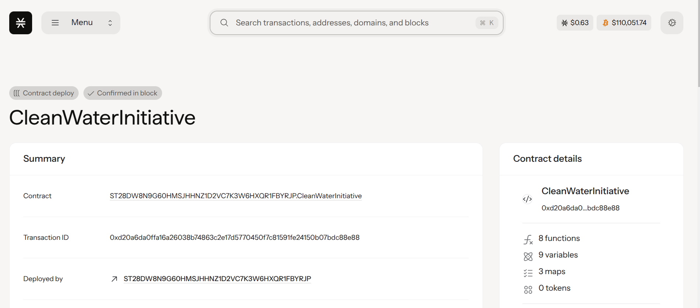

# CleanWater Initiative

## Project Description

The CleanWater Initiative is a blockchain-based platform built on the Stacks network that enables global funding of water projects through community-driven verification and maintenance tracking. Our smart contract facilitates transparent funding mechanisms where individuals and organizations can contribute STX tokens to support clean water projects worldwide. The platform ensures accountability through community verification systems and tracks ongoing maintenance funds to ensure long-term sustainability of water infrastructure projects.

## Project Vision

Our vision is to create a decentralized, transparent, and community-driven ecosystem that addresses the global water crisis by:

- **Democratizing Water Project Funding**: Enabling anyone, anywhere to contribute to clean water initiatives globally
- **Ensuring Transparency**: Providing full visibility into funding allocation, project progress, and maintenance activities
- **Community Verification**: Empowering local communities to verify project completion and ongoing maintenance
- **Sustainable Infrastructure**: Creating a maintenance fund system to ensure long-term operation of water projects
- **Global Impact**: Bridging the gap between donors worldwide and communities in need of clean water access

We believe that by leveraging blockchain technology, we can create a more efficient, transparent, and impactful approach to addressing water scarcity and quality issues globally.

## Future Scope

### Phase 1 (Current Implementation)
- Basic project funding mechanism
- Community verification system
- Maintenance tracking

### Phase 2 (Next 6 Months)
- **Multi-signature Governance**: Implement multi-sig wallets for project fund management
- **Milestone-based Funding**: Release funds based on verified project milestones
- **Geographic Mapping**: Integration with mapping services to visualize project locations
- **Impact Metrics**: Real-time tracking of people served and water quality improvements

### Phase 3 (Next 12 Months)
- **NFT Certificates**: Issue NFT certificates to donors and successful project completions
- **DAO Governance**: Transition to full decentralized autonomous organization governance
- **Mobile App Integration**: Develop mobile applications for field verification and monitoring
- **IoT Integration**: Connect with IoT sensors for automated water quality and usage monitoring

### Phase 4 (Long-term Vision)
- **Cross-chain Compatibility**: Expand to multiple blockchain networks
- **Carbon Credit Integration**: Link water projects with carbon offset programs
- **Micro-lending Features**: Enable micro-loans for small-scale water infrastructure
- **Educational Platform**: Develop educational resources about water conservation and management
- **Partnership Network**: Establish partnerships with NGOs, governments, and international organizations

### Technical Roadmap
- **Advanced Analytics**: Implement comprehensive data analytics and reporting dashboards
- **Automated Compliance**: Smart contract automation for regulatory compliance in different regions
- **Scalability Solutions**: Implement layer-2 solutions for reduced transaction costs
- **AI Integration**: Use AI for project risk assessment and funding recommendations

## Contract Address Details
Contract ID: ST28DW8N9G60HMSJHHNZ1D2VC7K3W6HXQR1FBYRJP.CleanWaterInitiative

### Deployment Information
- **Network**: [To be added]
- **Contract Address**: [To be added]
- **Deployment Block**: [To be added]
- **Contract Name**: cleanwater-initiative
- **Version**: 1.0.0

### Key Contract Functions
- `fund-water-project`: Contribute STX to fund water projects
- `verify-and-track-maintenance`: Verify project completion and add maintenance funds
- `create-water-project`: Create new water project (admin only)
- `add-community-verifier`: Add authorized community verifiers (admin only)

### Getting Started
1. Connect your Stacks wallet
2. Browse available water projects
3. Contribute STX to projects you want to support
4. Track project progress and maintenance activities
5. Participate in community verification if authorized

---